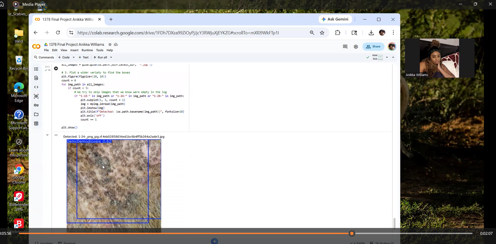

# MangeVision: AI-Driven Canine Mange Detection

*A high-speed computer vision system utilizing YOLOv8 Nano to identify and differentiate between Demodectic and Sarcoptic mange.*

## Team Member
* **Anikka Williams** - Lead Developer & Domain Expert (Veterinary Technician Background)

## Project Tier
**Tier 1** - While this project uses complex data integration and achieves high performance, it follows the Tier 1 foundational requirements for real-time object detection.

 ## Problem & Solution
### The Problem
Traditional diagnosis of canine mange requires invasive skin scrapings, which can be stressful for the animal and time-consuming for clinical staff. There is a need for a rapid, non-invasive triage tool to assist in early detection.

### Our Solution
MangeVision uses a trained YOLOv8 Nano model to analyze skin lesions in real-time. It provides instant classification, allowing veterinary staff to prioritize cases before invasive testing.

### Impact
This tool reduces diagnostic wait times and improves animal welfare by providing a non-contact preliminary screening method.

## Technical Details
### Approach
* **Task:** Object Detection
* **Model:** YOLOv8 Nano
* **Framework:** PyTorch / Ultralytics
* **Key Libraries:** OpenCV, Matplotlib, Roboflow

### Performance Metrics
| Metric | Value |
| :--- | :--- |
| **Inference Time** | 2.8ms - 3.2ms per image |
| **mAP50 (Overall)** | 50.6% |
| **mAP50 (Demodicosis)** | 80.5% |
| **mAP50 (Scabies)** | 20.7% |

### System Architecture
[Input: Skin Lesion Image] → [Preprocessing: Grayscale/Resize] → [Model: YOLOv8n Inference] → [Post-processing: NMS/Bounding Boxes] → [Output: Classification & Confidence]

### Dataset
* **Source:** Combined datasets from [Kaggle](https://www.kaggle.com/datasets/youssefmohmmed/dogs-skin-diseases-image-dataset) and [Roboflow](https://roboflow.com).
* **Total Images:** 1,350 images across 3 classes.
* **Classes:** Demodicosis, Scabies, Healthy.
* **Split:** Train: 80% | Val: 10% | Test: 10%

